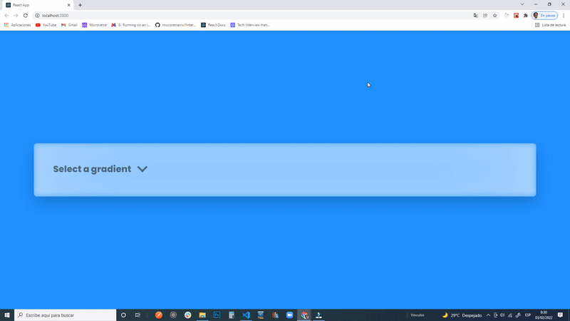

# Spring Chain
We built a custom select component with a menu with animations and beautiful gradients and a glassy style, is called "Spring Chain" because of how the animation is built, you can select any gradient from the list and the menu is displayed as a grid.

We also made use of the "spring chain" (react-spring library) to make some perfect animations.

## Live Demo
[Live](https://animated-select.netlify.app/)

## Video Tutorial
[Video Tutorial](https://www.youtube.com/watch?v=M7mRGFMxXZ4&t=6s)

## Built with
- JavaScript
- react
- TypeScript 
- react-spring (animations)
- css

## Author
### Cecilia Benitez
- 👤 [GitHub](https://github.com/Ceci007)

## Show your support
Give a ⭐️ if you like this project
